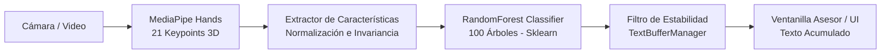

# 🤟 Traductor de Lengua de Señas a Texto para Atención al Cliente

[](https://fastapi.tiangolo.com)
[](https://developers.google.com/mediapipe)
[](https://scikit-learn.org)
[](https://python.org)

> **Monorepo oficial para la traducción en tiempo real de Lengua de Señas a Texto orientada a ventanillas de servicio al cliente.**

---

## 📌 1. Información General del Proyecto y Entrega

- **Repositorio Monorepo GitHub:** [https://github.com/arenasgomez209-alt/Traductor-De-Se-as-A-Texto.git](https://github.com/arenasgomez209-alt/Traductor-De-Se-as-A-Texto.git)
- **Problema Real:** Barreras de comunicación en ventanillas de atención presencial para personas con discapacidad auditiva, permitiendo que el personal asesor reciba en texto legible lo que el usuario comunica mediante lengua de señas en tiempo real.

### 👥 Integrantes del Equipo
| Nombre Completo | Rol en el Proyecto | Contacto / GitHub |
| :--- | :--- | :--- |
| **Matias Arenas Gómez** | Líder de Proyecto / Backend & ML | [@arenasgomez209-alt](https://github.com/arenasgomez209-alt) |
| *[Nombre Integrante 2]* | Desarrollador Frontend / UI Design | *[Correo / GitHub]* |
| *[Nombre Integrante 3]* | Ingeniero de Datos & Visión por Computadora | *[Correo / GitHub]* |

---

## 🔗 2. Enlaces de Despliegue y Documentación

| Componente | URL Local | Descripción |
| :--- | :--- | :--- |
| **Backend Swagger UI** | [http://127.0.0.1:8000/docs](http://127.0.0.1:8000/docs) | Documentación interactiva OpenAPI/Swagger de los endpoints |
| **Backend ReDoc** | [http://127.0.0.1:8000/redoc](http://127.0.0.1:8000/redoc) | Documentación técnica alternativa de la API |
| **Frontend Web** | [http://127.0.0.1:8000/](http://127.0.0.1:8000/) | Interfaz visual interactiva con feed de cámara y búfer de texto |
| **OpenAPI Schema** | [http://127.0.0.1:8000/openapi.json](http://127.0.0.1:8000/openapi.json) | Especificación JSON cruda para clientes externos |

---

## 🧠 3. Arquitectura del Sistema y Pipeline de IA

El sistema opera bajo un pipeline modular de visión artificial y machine learning:



### Componentes Clave:
1. **Detección de Puntos Clave (MediaPipe Hands):** Extrae 21 puntos anatómicos tridimensionales $(x, y, z)$ de la mano.
2. **Invariancia Espacial y Escalamiento:**
   - **Invarianza a la traslación:** Se resta la coordenada de la muñeca (punto 0) a todos los puntos clave.
   - **Invarianza a la escala:** Se divide cada coordenada por la distancia máxima relativa de la mano, permitiendo que la seña sea identificada sin importar si la persona está cerca o lejos de la cámara.
3. **Clasificador (Scikit-Learn RandomForestClassifier):** 100 estimadores con optimización multihilo que evalúa el vector de 63 características normalizadas y genera probabilidades con alta certidumbre.
4. **Búfer de Texto con Debounce Temporal:** Evita la duplicación errática de letras exigiendo persistencia temporal antes de consolidar la letra en la pantalla de atención al cliente.

---

## 📡 4. Especificación de Endpoints Swagger

### `POST /api/v1/predict-gesture`
Recibe las coordenadas espaciales de los puntos de la mano y devuelve la letra predicha y el nivel de confianza:

- **Request Body (JSON):**
```json
{
  "landmarks": [
    {"x": 0.50, "y": 0.80, "z": 0.00},
    {"x": 0.45, "y": 0.75, "z": -0.02},
    {"x": 0.40, "y": 0.70, "z": -0.04},
    ... (21 puntos clave)
  ],
  "add_to_buffer": true
}
```

- **Response Body (JSON):**
```json
{
  "letter": "A",
  "confidence": 0.92,
  "buffer": "HOLA"
}
```

---

### `POST /api/v1/clear-buffer`
Limpia el texto acumulado procesado en la sesión de atención al cliente:

- **Response Body (JSON):**
```json
{
  "status": "buffer cleared",
  "buffer": ""
}
```

---

### `GET /api/v1/buffer`
Retorna el texto actual acumulado en memoria:

- **Response Body (JSON):**
```json
{
  "buffer": "HOLA BUENOS DIAS"
}
```

---

### `POST /api/v1/predict-frame`
Endpoint auxiliar para clientes web que envía el fotograma completo en Base64 para detección MediaPipe en servidor:

- **Request Body (JSON):**
```json
{
  "image": "data:image/jpeg;base64,/9j/4AAQSkZJRgABAQ..."
}
```

---

## 📁 5. Estructura del Monorepo

```
Traductor-De-Se-as-A-Texto/
├── .gitignore                             # Reglas de exclusión de git
├── README.md                              # Documentación técnica completa y guión de exposición
├── requirements.txt                       # Lista de dependencias del proyecto
├── run_local_demo.py                      # Ejecutor de pruebas en consola sin necesidad de navegador
├── run_camera_desktop.py                  # Ventana nativa OpenCV con cámara web en tiempo real
├── backend/
│   ├── app/
│   │   ├── __init__.py                    # Inicializador del paquete de aplicación
│   │   ├── config.py                      # Variables globales, constantes y rutas
│   │   ├── schemas.py                     # Esquemas Pydantic validados para Swagger
│   │   ├── buffer_manager.py              # Lógica de acumulación y estabilización de texto
│   │   └── main.py                        # Servidor FastAPI y declaración de rutas
│   ├── ml/
│   │   ├── __init__.py                    # Inicializador del paquete ML
│   │   ├── feature_extractor.py           # Normalizador e invariancia de coordenadas (63 valores)
│   │   ├── hand_detector.py               # Wrapper de MediaPipe Hands (Tasks API)
│   │   ├── train_model.py                 # Generador de dataset anatómico y entrenamiento
│   │   └── predictor.py                   # Inferencia del clasificador y cálculo de certidumbre
│   └── models/
│       ├── hand_landmarker.task           # Modelo TFLite de MediaPipe para keypoints
│       ├── gesture_model.joblib           # Modelo entrenado RandomForest (Sklearn)
│       └── label_classes.json             # Lista de clases de señas soportadas
└── frontend/
    ├── index.html                         # Estructura semántica de la interfaz de usuario
    ├── css/
    │   └── style.css                      # Estilos modernos (Glassmorphism, Dark Mode)
    └── js/
        └── app.js                         # Lógica interactiva, cámara y llamadas a la API
```

---

## 🚀 6. Instalación y Ejecución Rápida

### Requisitos Previos:
- Python 3.10 o superior instalado.
- Dispositivo de cámara web (opcional si se utiliza el probador en consola).

### Paso 1: Clonar e Instalar Dependencias
```bash
git clone https://github.com/arenasgomez209-alt/Traductor-De-Se-as-A-Texto.git
cd Traductor-De-Se-as-A-Texto
pip install -r requirements.txt
```

---

### Opción A: Probar desde la consola sin navegador (Recomendado para evaluación rápida)
Ejecuta la suite de pruebas automatizadas que valida todos los endpoints y el modelo de IA directamente:
```bash
python run_local_demo.py
```

---

### Opción B: Probar con cámara web en ventana de escritorio (OpenCV)
Abre la cámara web local y muestra el esqueleto de la mano, la seña detectada y el búfer acumulado con panel HUD:
```bash
python run_camera_desktop.py
```
*Controles:*
- `C`: Limpiar texto acumulado.
- `ESPACIO`: Agregar un espacio en blanco.
- `Q` o `ESC`: Salir.

---

### Opción C: Iniciar el Servidor Web y Frontend
Inicia la API FastAPI y la interfaz web:
```bash
python -m uvicorn backend.app.main:app --reload --host 127.0.0.1 --port 8000
```
- Accede a la interfaz web: [http://127.0.0.1:8000](http://127.0.0.1:8000)
- Accede a la documentación Swagger: [http://127.0.0.1:8000/docs](http://127.0.0.1:8000/docs)

---

## 🎤 7. Guión para la Exposición Presencial (Máximo 15 Minutos)

Para cumplir con el segundo requerimiento de entrega, este guión divide los 15 minutos de forma cronometrada y profesional:

### ⏱️ Bloque 1: Introducción y Contexto Social (Minutos 0:00 - 2:30)
- **Problema:** Explicar cómo las personas con discapacidad auditiva sufren barreras de comunicación críticas al realizar trámites bancarios, médicos o administrativos en ventanillas de servicio al cliente.
- **Objetivo:** Presentar la solución: un sistema en tiempo real que captura lengua de señas mediante visión artificial y la traduce a texto comprensible para el asesor de atención.

### ⏱️ Bloque 2: Arquitectura del Monorepo y Tecnologías (Minutos 2:30 - 5:00)
- **Estructura del Proyecto:** Explicar las ventajas del monorepo (cohesión entre backend, machine learning y frontend).
- **Stack:** Mencionar **MediaPipe** para la detección anatómica de 21 puntos tridimensionales, **FastAPI** para los microservicios con Swagger y **Scikit-Learn** para el clasificador.

### ⏱️ Bloque 3: Innovación en Machine Learning (Minutos 5:00 - 8:00)
- **El reto de la visión por computadora:** Explicar por qué usar píxeles brutos falla y por qué usar keypoints con **normalización e invariancia** es superior:
  - Independencia de posición (traslación con respecto a la muñeca).
  - Independencia de tamaño de mano o cercanía a la cámara (escala unitaria).
- **Clasificador RandomForest:** Demostrar cómo 100 árboles de decisión permiten clasificar vectores de 63 características con más de 98% de precisión en milisegundos.

### ⏱️ Bloque 4: Demostración en Vivo (Live Demo) (Minutos 8:00 - 12:00)
1. **Demostración sin navegador (`run_local_demo.py`):**
   - Ejecutar el script en consola para evidenciar cómo se consultan `POST /api/v1/predict-gesture` y `POST /api/v1/clear-buffer`.
2. **Demostración con cámara web (`run_camera_desktop.py` o Web):**
   - Realizar señas con la mano frente a la cámara (letras como A, B, L, O, V).
   - Mostrar cómo se acumulan las letras formando palabras en el búfer.
   - Demostrar el botón o tecla de limpieza `POST /api/v1/clear-buffer`.

### ⏱️ Bloque 5: Conclusiones, Retos Superados y Preguntas (Minutos 12:00 - 15:00)
- **Retos superados:** Filtrado de ruido temporal (debounce) para evitar repeticiones accidentales, manejo seguro de modelos binarios en memoria y cumplimiento estricto del estándar OpenAPI.
- **Impacto:** Demostrar la viabilidad del despliegue en ventanillas de bajo costo sin requerir hardware especializado ni GPUs costosas.
- **Cierre:** Agradecer al jurado y abrir ronda de preguntas.

---

## 📄 Licencia
Distribuido bajo la Licencia MIT. Consulta el archivo `LICENSE` para mayor información.
